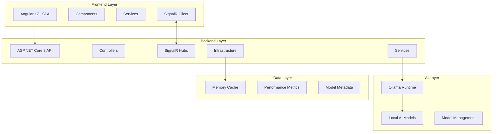
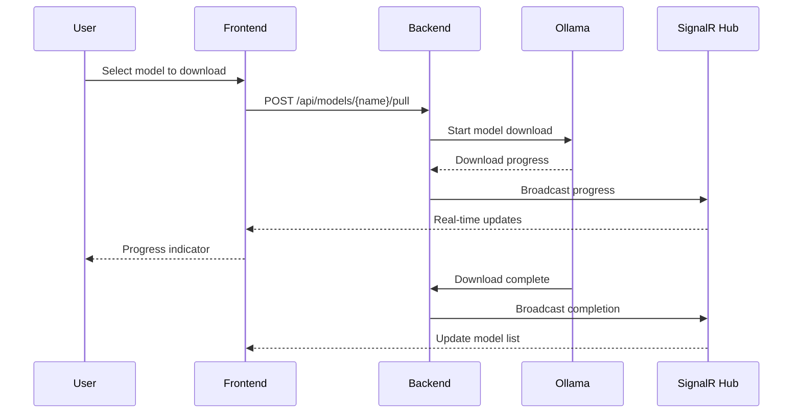
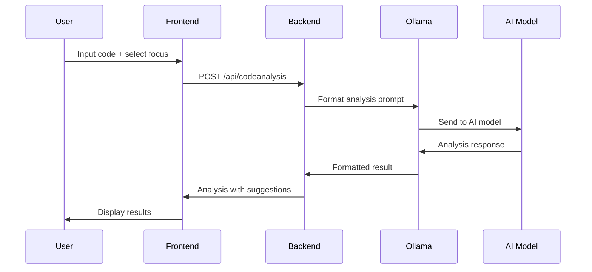
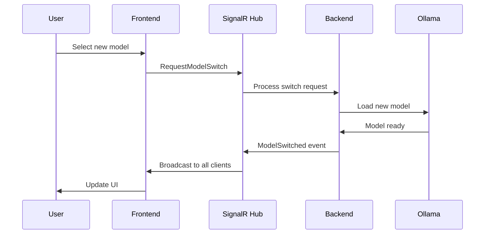

# 🤖 CodeMentorAI - Complete Application Architecture Guide

## 📋 Table of Contents
- [Overview](#overview)
- [System Architecture](#system-architecture)
- [Technology Stack](#technology-stack)
- [Application Components](#application-components)
- [Data Flow](#data-flow)
- [API Endpoints](#api-endpoints)
- [Real-time Communication](#real-time-communication)
- [Model Management](#model-management)
- [Performance & Optimization](#performance--optimization)
- [Configuration](#configuration)
- [Deployment](#deployment)

## 🎯 Overview

CodeMentorAI is a comprehensive AI-powered code assistance platform that combines a modern Angular frontend with a robust .NET Core backend to provide intelligent code analysis, chat capabilities, and model management through local Ollama AI models.

### Key Features
- **🔄 Dynamic Model Switching** - Real-time AI model selection and switching
- **💬 Interactive AI Chat** - Conversational code assistance
- **📊 Code Analysis** - Deep code review with AI-powered insights
- **🎛️ Model Management** - Download, install, and manage AI models
- **📈 Performance Monitoring** - Real-time model performance tracking
- **🔗 Real-time Updates** - Live status updates via SignalR

## 🏗️ System Architecture



## 🛠️ Technology Stack

### Frontend (Angular)
- **Framework**: Angular 17+ with Standalone Components
- **Language**: TypeScript 5.0+
- **State Management**: RxJS Observables & BehaviorSubjects
- **Real-time**: SignalR Client (@microsoft/signalr)
- **HTTP**: Angular HttpClient with interceptors
- **UI**: Custom CSS3 with responsive design
- **Code Editor**: Monaco Editor integration

### Backend (.NET Core)
- **Framework**: ASP.NET Core 8.0
- **Language**: C# 12
- **Real-time**: SignalR for live updates
- **Caching**: IMemoryCache for performance
- **HTTP Client**: HttpClient for Ollama integration
- **Compression**: Gzip & Brotli response compression
- **Logging**: Built-in .NET logging with console output

### AI Integration
- **Runtime**: Ollama (Local AI model server)
- **Models**: Support for multiple LLMs (Llama, CodeLlama, Mistral, etc.)
- **API**: RESTful integration with Ollama API
- **Management**: Automated model download and lifecycle management

## 🧩 Application Components

### Frontend Architecture

#### Core Components
1. **AppComponent** (`full-app.component.ts`)
   - Main application shell with navigation
   - Model selector integration
   - View routing and state management

2. **Chat Component** (`simple-ollama-chat.component.ts`)
   - Real-time AI conversation interface
   - Message history management
   - Model-specific chat optimization

3. **Code Analysis Component** (`code-analysis.component.ts`)
   - Code input with syntax highlighting
   - AI-powered analysis with multiple focus areas
   - Results display with suggestions

4. **Model Management Components**
   - Model Dashboard: Overview of installed models
   - Model Download: Browse and install new models
   - Model Selector: Dynamic model switching

#### Services Layer
1. **ModelService** - Core model management and API communication
2. **SignalRService** - Real-time communication with backend
3. **ModelRegistryService** - Model discovery and download management
4. **ErrorHandlerService** - Centralized error handling
5. **LoggerService** - Frontend logging and debugging

### Backend Architecture

#### API Controllers
1. **ModelsController** (`/api/models`)
   - GET: List all available models
   - DELETE: Remove specific models
   - POST: Download and install models
   - GET: Model performance metrics

2. **CodeAnalysisController** (`/api/codeanalysis`)
   - POST: Analyze code with AI models
   - Supports multiple analysis focuses (quality, security, performance)

3. **ChatController** (`/api/chat`)
   - POST: Send chat messages to AI models
   - Streaming response support

4. **ModelRegistryController** (`/api/modelregistry`)
   - GET: Browse available models from registry
   - POST: Search models with filters

#### Core Services
1. **OllamaService** - Direct integration with Ollama API
2. **ModelPerformanceTracker** - Performance metrics collection
3. **ModelDownloadService** - Model installation management
4. **ModelCapabilityService** - Model feature detection
5. **OllamaStartupService** - Automatic Ollama lifecycle management

#### SignalR Hubs
- **ModelHub** (`/modelhub`) - Real-time model events and updates

## 🔄 Data Flow

### Model Selection Flow
```
User Selects Model → Frontend Service → SignalR Hub → Backend Service → Ollama API → Model Switch → Real-time Update
```

### Code Analysis Flow
```
Code Input → Analysis Request → Backend Controller → Ollama Service → AI Model → Analysis Result → Frontend Display
```

### Chat Interaction Flow
```
User Message → Chat Service → Backend API → Ollama Model → AI Response → Real-time Display
```

## 🌐 API Endpoints

### Models API
- `GET /api/models` - Get all installed models
- `GET /api/models/{name}` - Get specific model details
- `DELETE /api/models/{name}` - Remove a model
- `POST /api/models/{name}/pull` - Download a model
- `GET /api/models/{name}/performance` - Get model performance metrics

### Code Analysis API
- `POST /api/codeanalysis` - Analyze code
  ```json
  {
    "code": "string",
    "language": "auto|javascript|python|...",
    "model": "llama3.2:latest",
    "focus": "codeQuality|performance|security|bugs|refactoring"
  }
  ```

### Chat API
- `POST /api/chat` - Send chat message
  ```json
  {
    "message": "string",
    "model": "llama3.2:latest",
    "context": "optional conversation context"
  }
  ```

### Model Registry API
- `GET /api/modelregistry/featured` - Get featured models
- `POST /api/modelregistry/search` - Search available models
- `GET /api/modelregistry/{name}` - Get model details

## ⚡ Real-time Communication

### SignalR Events
- `ModelSwitched` - Model change notifications
- `ModelPullProgress` - Download progress updates
- `ModelPullCompleted` - Download completion
- `ModelRemoved` - Model deletion events
- `ModelPerformanceUpdate` - Performance metrics updates

### Connection Management
- Automatic reconnection on connection loss
- Connection state monitoring
- Group-based model subscriptions

## 🎛️ Model Management

### Supported Models
- **Llama 3.2** - General purpose conversational AI
- **CodeLlama** - Specialized for code generation and analysis
- **Mistral** - High-performance general AI model
- **Phi-3** - Lightweight efficient model
- **DeepSeek Coder** - Advanced code-focused model
- **Qwen 2.5 Coder** - Code analysis specialist

### Model Capabilities
Each model includes capability metadata:
- Code Analysis, Generation, Documentation
- Chat and Debugging support
- Supported programming languages
- Optimal use cases and performance characteristics

### Automatic Management
- **Auto-start**: Ollama automatically starts if not running
- **Health Monitoring**: Continuous model availability checking
- **Performance Tracking**: Response time and resource usage monitoring
- **File System Watching**: Automatic detection of model changes

## 🚀 Performance & Optimization

### Caching Strategy
- **Frontend**: 5-minute model list caching
- **Backend**: Memory cache for model metadata
- **HTTP**: Response caching with appropriate headers
- **Compression**: Gzip/Brotli for API responses

### Real-time Optimization
- **SignalR**: Optimized connection settings
- **Streaming**: Support for streaming AI responses
- **Debouncing**: Input debouncing for better UX
- **Lazy Loading**: Component-based code splitting

### Resource Management
- **Connection Pooling**: Efficient HTTP client usage
- **Memory Management**: Proper disposal of resources
- **Error Recovery**: Automatic retry mechanisms
- **Timeout Handling**: Configurable request timeouts

## ⚙️ Configuration

### Backend Configuration (`appsettings.json`)
```json
{
  "Ollama": {
    "BaseUrl": "http://localhost:11434"
  },
  "Logging": {
    "LogLevel": {
      "Default": "Information"
    }
  }
}
```

### Frontend Configuration (`app.constants.ts`)
```typescript
export const API_CONFIG = {
  BASE_URL: 'http://localhost:5000',
  TIMEOUT: 300000,
  RETRY_ATTEMPTS: 3
};
```

## 🚀 Deployment

### Development Setup
1. **Prerequisites**: Ollama, Node.js 18+, .NET 8 SDK
2. **Backend**: `dotnet run` in CodeMentorAI.API
3. **Frontend**: `ng serve` in CodeMentorAI.Web
4. **Access**: http://localhost:4200

### Production Considerations
- **Reverse Proxy**: Configure for API and SignalR
- **SSL/TLS**: Enable HTTPS for secure communication
- **Monitoring**: Implement health checks and logging
- **Scaling**: Consider load balancing for multiple instances

## 🔧 Detailed Component Breakdown

### Frontend Component Details

#### 1. Model Selector Component
**Location**: `src/app/components/model-selector/`
**Purpose**: Dynamic AI model selection with real-time switching

**Key Features**:
- Dropdown interface for model selection
- Real-time model availability checking
- Performance metrics display
- Model capability indicators

**Integration**:
```typescript
// Model switching with SignalR
async switchModel(modelName: string) {
  await this.signalRService.requestModelSwitch(modelName, userId, sessionId);
  // Real-time update via SignalR event
}
```

#### 2. Chat Interface Component
**Location**: `src/app/components/ollama-chat/`
**Purpose**: Interactive AI conversation interface

**Key Features**:
- Message history with persistence
- Typing indicators and loading states
- Code syntax highlighting in responses
- Model-specific optimizations
- Auto-scroll and message formatting

**Message Flow**:
```typescript
// Send message to AI
async sendMessage(message: string) {
  const response = await this.http.post('/api/chat', {
    message,
    model: this.selectedModel,
    context: this.conversationContext
  });
  this.messages.push({ user: message, ai: response.content });
}
```

#### 3. Code Analysis Component
**Location**: `src/app/components/code-analysis/`
**Purpose**: AI-powered code review and analysis

**Analysis Types**:
- **Code Quality**: Best practices, maintainability
- **Performance**: Optimization suggestions
- **Security**: Vulnerability detection
- **Bug Detection**: Potential issues identification
- **Refactoring**: Code improvement recommendations

**Usage Example**:
```typescript
// Analyze code with specific focus
analyzeCode() {
  const request = {
    code: this.codeInput,
    language: 'auto', // Auto-detected
    model: this.selectedModel,
    focus: this.selectedFocus // 'codeQuality' | 'performance' | etc.
  };

  this.http.post('/api/codeanalysis', request)
    .subscribe(result => this.displayAnalysis(result));
}
```

### Backend Service Details

#### 1. OllamaService
**Location**: `src/CodeMentorAI.Infrastructure/Services/OllamaService.cs`
**Purpose**: Core integration with Ollama AI runtime

**Key Responsibilities**:
- Model lifecycle management
- AI request/response handling
- Performance metrics collection
- Error handling and retry logic
- Caching for improved performance

**Core Methods**:
```csharp
// Get available models with caching
public async Task<List<OllamaModel>> GetAvailableModelsAsync()
{
    // Check cache first, then fetch from Ollama API
    // Cache for 5 minutes to improve performance
}

// Generate AI response
public async Task<OllamaResponse> GenerateAsync(OllamaRequest request)
{
    // Send request to Ollama, track performance metrics
    // Handle streaming responses if needed
}
```

#### 2. ModelPerformanceTracker
**Location**: `src/CodeMentorAI.Infrastructure/Services/ModelPerformanceTracker.cs`
**Purpose**: Monitor and track AI model performance

**Metrics Tracked**:
- Response time per request
- Tokens per second
- Memory usage
- CPU utilization
- Request success/failure rates
- Model load times

#### 3. SignalR ModelHub
**Location**: `src/CodeMentorAI.API/Hubs/ModelHub.cs`
**Purpose**: Real-time communication for model events

**Hub Methods**:
```csharp
// Client can request model switch
public async Task RequestModelSwitch(string modelName, string userId, string sessionId)
{
    // Validate and switch model
    // Broadcast success/failure to all clients
    await Clients.All.SendAsync("ModelSwitched", result);
}

// Subscribe to model updates
public async Task SubscribeToModelUpdates()
{
    await Groups.AddToGroupAsync(Context.ConnectionId, "ModelUpdates");
}
```

## 🔄 Advanced Workflows

### Model Download Workflow


### Code Analysis Workflow


### Real-time Model Switching


## 🛡️ Security & Error Handling

### Security Measures
- **CORS Configuration**: Restricted to specific origins
- **Input Validation**: Server-side validation for all inputs
- **Rate Limiting**: Configurable request limits
- **Error Sanitization**: No sensitive data in error responses

### Error Handling Strategy
- **Frontend**: HTTP interceptors for global error handling
- **Backend**: Structured exception handling with logging
- **Retry Logic**: Automatic retry for transient failures
- **Graceful Degradation**: Fallback when AI models unavailable

### Monitoring & Logging
- **Structured Logging**: JSON-formatted logs with correlation IDs
- **Performance Metrics**: Response times and resource usage
- **Health Checks**: Endpoint for monitoring system health
- **Error Tracking**: Comprehensive error logging and alerting

---

*This comprehensive architecture documentation provides a complete understanding of how CodeMentorAI operates, from high-level system design to detailed component interactions and workflows.*
